# 採用市場レポート高度化プロジェクト  
## 実装計画書（公開データ×求人スクレイピング×企業リスト×コンサルヒアリング）

- 文書目的：別のAIまたは開発担当者が、背景を再確認せずに実装へ着手できる状態を作る
- 対象：既存の「求人市場総合診断レポート」を基盤とした、コンサル支援用アウトプットの追加
- 方針：既存レポートを置き換えず、「客観情報」「仮説」「ヒアリング」「最終施策」を分離する
- 改訂版：2026-07-10（実CSV監査反映版）

---

# 1. 背景・経緯

## 1.1 現在の成果物

現在、以下のデータを組み合わせた約32ページの「求人市場総合診断レポート」が存在する。

- 求人媒体から取得した求人スクレイピングデータ
- 国勢調査、e-Stat、最低賃金、人口、通勤、産業構造等のオープンデータ
- 企業リストデータ
- 企業別の従業員数・従業員増減
- 求人カード上で観測できる求人タイトル、企業名、勤務地、給与表記、掲載タグ、掲載経過表示等
- 一方のCSVにのみ存在する雇用形態、一部説明抜粋等

既存レポートには、以下の章が含まれる。

1. Executive Summary
2. 地域データ補強
3. 給与分布統計
4. 採用市場逼迫度
5. 地域企業構造
6. 人材デモグラフィック
7. 最低賃金・ライフスタイル
8. 年間休日×給与
9. 採用マーケットインテリジェンス
10. 採用環境の詳細分析
11. 注記・出典・免責

## 1.2 現在認識している課題

個別データの品質や網羅性には一定の価値がある一方、以下の問題がある。

- データが章ごとに独立し、「複数データを組み合わせると何が言えるか」が弱い
- 公開情報だけでは顧客固有の採用課題を断定できない
- 給与、人口、通勤、求人件数、従業員増減等を一つの総合点にすると、根拠の弱い精密なスコアになりやすい
- 複合的な解釈は、本来コンサルが顧客の実情を聞きながら行うべき領域である
- 一方で、すべてを現場コンサルの経験と能力に依存すると、事前準備時間と品質にばらつきが出る

## 1.3 解決方針

システムが最終診断を自動化するのではなく、以下を自動化する。

> コンサルが顧客との会話で検証すべき仮説、矛盾、質問、分岐、施策候補を事前に整理する。

既存の市場レポートは「証拠レイヤー」として維持し、その上に別アウトプットを追加する。

---

# 2. プロジェクトの目的

## 2.1 最終目的

公開データと顧客ヒアリングを分離・接続し、経験の浅いコンサルでも一定水準の採用診断を実施できる仕組みを作る。

## 2.2 実現する状態

### 面談前

コンサルは以下を短時間で把握できる。

- 市場で確認できた客観的事実
- 有力な採用課題仮説
- 仮説を支持する根拠
- 仮説に反する根拠
- 追加で確認すべき情報
- 顧客に聞くべき質問
- 回答別の次の深掘り

### 面談中

コンサルは質問票を機械的に読むのではなく、回答に応じて仮説を更新できる。

### 面談後

市場データとヒアリング結果を統合し、顧客固有のアクションメモを生成できる。

## 2.3 非目的

本プロジェクトでは以下を目指さない。

- 公開データだけで採用成功確率を断定する
- 応募数、採用数、採用単価を根拠なく精密予測する
- コンサルの判断を完全に自動化する
- すべてのデータを一つの総合スコアに集約する
- 相関関係から因果関係を断定する
- 既存市場レポートを廃止する

---

# 3. 成果物の全体構成

成果物はMECEに4種類へ分離する。

| No. | 成果物 | 利用者 | 作成タイミング | 主目的 |
|---|---|---|---|---|
| 1 | 求人市場総合診断レポート | 顧客・コンサル | 面談前 | 客観的な市場情報を共有 |
| 2 | 採用仮説ブリーフ | コンサル内部 | 面談前 | 仮説・矛盾・質問の整理 |
| 3 | ヒアリングシート | コンサル・顧客 | 面談中 | 顧客固有情報の収集 |
| 4 | 個社別アクションメモ | 顧客・コンサル | 面談後 | 合意した施策とKPIの明文化 |

補助成果物として、全出力の根拠を保持する `evidence_pack.json` を生成する。

---

# 4. システム全体像

```mermaid
flowchart TD
    A[求人スクレイピング] --> E[データ正規化]
    B[オープンデータ] --> E
    C[企業リスト・従業員増減] --> E
    D[対象求人・対象企業情報] --> E

    E --> F[証拠データストア]
    F --> G[指標生成]
    G --> H[シグナル生成]
    H --> I[仮説・矛盾検出]
    I --> J[採用仮説ブリーフ]
    I --> K[ヒアリングシート]

    F --> L[既存市場レポート]
    K --> M[コンサルヒアリング入力]
    M --> N[仮説更新・判定]
    N --> O[個社別アクションメモ]

    F --> P[evidence_pack.json]
    H --> P
    I --> P
    N --> P
```



---

# 5. データ設計

## 5.0 実CSVの監査結果と前提

本設計は、次の2ファイルを実際に確認した結果を前提とする。

| ファイル | 行数 | 主な特徴 |
|---|---:|---|
| `indeed-2026-07-01.csv` | 150 | 雇用形態あり。求人タイトル、企業名、勤務地、給与、求人カードタグ、掲載経過表示あり。説明文は基本的になく、短い訴求文も18%程度のみ |
| `indeed-2026-07-01 (1).csv` | 225 | 求人タイトル、企業名、勤務地、給与、求人カードタグ、掲載経過表示、一部の説明抜粋あり。雇用形態の専用列はない。説明抜粋は途中で切れた表示テキストであり、求人票全文ではない |

### CSVから直接取得できる主要情報

- 求人URL
- 求人タイトル
- 短い訴求文（欠損が多い）
- 企業名
- 勤務地文字列
- 給与文字列
- 求人カード上のタグ
- 応募方式表示
- 高返信率・人気等の表示
- 「13日前」「30+日前」等の掲載経過表示
- 新着表示
- 一部ファイルのみ雇用形態
- 一部ファイルのみ説明抜粋

### 現行CSVの列マッピング

CSSセレクタ名はサイト変更で変わり得るため、コード内へ直接散在させず、ファイル形式別の設定として管理する。

#### `indeed-2026-07-01.csv`

| 元列 | 意味列 |
|---|---|
| `css-1hq3y4h` | `new_badge` |
| `css-1hwmqh1` | `employment_type_observed` |
| `css-bxyec3 href` | `job_url` |
| `css-bxyec3` | `job_title_raw` |
| `css-lx9x6g` | `promo_text_raw` |
| `css-14qk2ra` | `company_name_raw` |
| `css-18rxko3` | `location_raw` |
| `css-18rxko3 (2)` | `salary_text_raw` |
| `css-ge6x3l src` | `image_url` |
| `jobsearch-JobCard-tag` ～ `(10)` | `job_card_tags_raw` |
| `css-1c8ncmc` | `apply_badge` |
| `css-o67di7` | `posting_age_text` |
| `css-1ih6vdn` | `response_badge` |
| `css-u74ql7` | `popularity_badge` |
| `css-1qns26f` | `review_count_text` |

#### `indeed-2026-07-01 (1).csv`

| 元列 | 意味列 |
|---|---|
| `css-bxyec3 href` | `job_url` |
| `css-bxyec3` | `job_title_raw` |
| `css-lx9x6g` | `promo_text_raw` |
| `css-14qk2ra` | `company_name_raw` |
| `css-18rxko3` | `location_raw` |
| `css-18rxko3 (2)` | `salary_text_raw` |
| `css-ge6x3l src` | `image_url` |
| `jobsearch-JobCard-tag` ～ `(11)` | `job_card_tags_raw` |
| `css-1c8ncmc` | `apply_badge` |
| `css-1ih6vdn` | `response_badge` |
| `css-u74ql7` | `popularity_badge` |
| `css-o67di7` | `posting_age_text` |
| `css-1vlebyu` | `description_excerpt_raw` |
| `css-1hq3y4h` | `new_badge` |
| `css-1qns26f` | `review_count_text` |

次の列は、今回の抽出設定によって生成された検索語断片・画面要素であり、初期実装では分析対象外とする。

- `css-1vlebyu (2)` ～ `css-1vlebyu (12)`
- `css-j40pyi`

これらには「年間」「休日」「ドライバー」等が格納されているが、求人条件を表す独立列ではない。

### CSVから直接取得できない情報

以下は専用列として存在せず、完全性も保証できないため、求人CSVの基礎データ項目として扱わない。

- 必須資格の完全な一覧
- 福利厚生の完全な一覧
- 年間休日の完全な値
- 固定残業代の構造化情報
- 勤務時間・休憩・残業時間の完全な情報
- 求人票全文
- 正確な掲載開始日
- 募集人数
- 採用実績
- 応募数、面接数、採用数

求人カードタグに「交通費支給」「賞与あり」「資格取得支援あり」等が出ることはあるが、これはIndeedがカード上に表示した一部タグであり、企業の福利厚生全体ではない。  
説明抜粋に免許や年間休日の記載が含まれることはあるが、文章が途中で切れており、記載がないことを「条件がない」と解釈できない。

したがって初期実装では、これらを次のように扱う。

- `benefits` ではなく `job_card_tags`
- `required_license` ではなく、必要な場合のみ `license_keyword_mentions`
- `annual_holidays` ではなく、必要な場合のみ `annual_holiday_mentions`
- キーワード抽出結果はすべて「観測できた記載」であり、「求人条件の全体」を意味しない
- 上記3項目はMVPの主要診断指標には使用しない

## 5.1 共通分析単位

原則として、以下の粒度に統一する。

> 企業 × 職種 × 地域 × 観測時点

雇用形態は取得できるファイルに限って追加ディメンションとして使用する。全データが同じ粒度を持つ必要はなく、持てない場合はどの階層のデータかを明示する。

| 階層 | 例 |
|---|---|
| 企業×職種×地域×観測時点 | 求人カード・説明抜粋の観測 |
| 企業×時点 | 従業員数、従業員増減 |
| 地域×職種×時点 | 有効求人倍率、求人件数 |
| 地域×時点 | 人口、通勤、最低賃金、家賃 |
| 企業×職種 | 顧客の採用対象求人 |

## 5.2 必須エンティティ

### A. `job_posting_observation`

求人票そのものではなく、スクレイピング時点で求人カードまたは抜粋から観測できた情報を保存する。

| フィールド | 型 | 必須 | 取得区分 | 内容 |
|---|---|---:|---|---|
| observation_id | string | ○ | 派生 | 観測レコード一意ID |
| source_file | string | ○ | 観測 | 元CSVファイル名 |
| source_row_number | integer | ○ | 観測 | 元CSV行番号 |
| source | string | ○ | 固定 | Indeed |
| job_url | string | ○ | 観測 | 求人URL |
| job_key | string |  | 派生 | `viewjob?jk=`から取得できる場合のみ |
| job_title_raw | string | ○ | 観測 | 求人タイトル |
| promo_text_raw | string |  | 観測 | 短い訴求文。欠損が多い |
| company_name_raw | string | ○ | 観測 | 取得時の企業名 |
| location_raw | string | ○ | 観測 | 勤務地文字列 |
| salary_text_raw | string |  | 観測 | 給与表示文字列 |
| image_url | string |  | 観測 | 求人カード画像URL |
| job_card_tags_raw | array |  | 観測 | 求人カード上に表示されたタグのみ |
| apply_badge | string |  | 観測 | カンタン応募、Indeedで応募等 |
| response_badge | string |  | 観測 | 高返信率等 |
| popularity_badge | string |  | 観測 | 人気、超人気等 |
| posting_age_text | string | ○ | 観測 | 13日前、30+日前、5時間前等 |
| new_badge | string |  | 観測 | 新着等 |
| review_count_text | string |  | 観測 | クチコミ件数表示 |
| employment_type_observed | string |  | 観測 | 150行側CSVに存在。225行側にはない |
| description_excerpt_raw | text |  | 観測 | 225行側CSVの途中で切れた説明抜粋 |
| scraped_at | datetime | ○ | 実行メタデータ | CSV生成・取得時刻。CSV外から付与 |
| content_hash | string | ○ | 派生 | 重複・変化検知用 |

### A-2. `job_posting_derived`

観測データから、再現可能なルールまたは分類処理によって生成する。

| フィールド | 型 | 内容 |
|---|---|---|
| observation_id | string | 観測レコードID |
| company_id | string | 企業名寄せ後の内部ID |
| prefecture | string | `location_raw`から抽出 |
| municipality | string | `location_raw`から抽出できる場合 |
| occupation_code | string | 求人タイトルを基にした推定職種 |
| salary_type | string | 月給、時給、日給、年収等 |
| salary_min_normalized | number | 単位内の下限値 |
| salary_max_normalized | number | 単位内の上限値 |
| monthly_salary_estimate_min | number | 換算前提を満たす場合のみ |
| monthly_salary_estimate_max | number | 換算前提を満たす場合のみ |
| posting_age_lower_bound_days | number | `30+日前`等を下限として変換 |
| normalized_card_tags | array | カードタグの表記統一 |
| duplicate_group_id | string | 重複・再掲載候補グループ |
| derivation_notes | array | 推定条件、欠損、制約 |

### A-3. 初期実装から除外する構造化項目

以下を `job_posting` の標準フィールドとして実装しない。

- `required_license`
- `benefits`
- `annual_holidays`
- `working_hours`
- `fixed_overtime`
- `number_of_openings`
- `published_at`

説明抜粋やカードタグから該当語を検出する拡張機能を作る場合は、条件そのものではなく、必ず次の「記載検出」形式にする。

```json
{
  "mention_type": "license_keyword",
  "value": "大型自動車第一種運転免許",
  "evidence_text": "【必須条件】大型自動車第一種運転免許",
  "source_field": "description_excerpt_raw",
  "coverage": "partial_excerpt",
  "absence_is_not_negative": true
}
```

### B. `company_master`

| フィールド | 型 | 必須 | 内容 |
|---|---|---:|---|
| company_id | string | ○ | 内部企業ID |
| corporate_number | string |  | 法人番号 |
| company_name | string | ○ | 正規化企業名 |
| industry_code | string |  | 業種 |
| headquarters_prefecture | string |  | 本社所在地 |
| headquarters_municipality | string |  | 市区町村 |
| source_confidence | string | ○ | high/medium/low |

### C. `employee_history`

| フィールド | 型 | 必須 | 内容 |
|---|---|---:|---|
| company_id | string | ○ | 企業ID |
| observed_at | date | ○ | 観測日 |
| employee_count | number | ○ | 従業員数 |
| employee_change_abs | number |  | 前回比人数 |
| employee_change_rate | number |  | 前回比率 |
| source | string | ○ | 出典 |
| note | string |  | 更新差異等 |

### D. `regional_stat`

| フィールド | 型 | 必須 | 内容 |
|---|---|---:|---|
| stat_id | string | ○ | 指標ID |
| prefecture | string | ○ | 都道府県 |
| municipality | string |  | 市区町村 |
| occupation_code | string |  | 職種分類 |
| period | string | ○ | 基準時点 |
| metric_name | string | ○ | 指標名 |
| value | number | ○ | 値 |
| unit | string | ○ | 単位 |
| source_name | string | ○ | 出典 |
| source_url | string |  | 出典URL |
| granularity | string | ○ | 都道府県、市区町村等 |

### E. `client_context`

面談前に与えられる顧客情報。

| フィールド | 内容 |
|---|---|
| client_id | 顧客ID |
| target_company_id | 対象企業ID |
| target_occupation | 採用職種 |
| target_location | 勤務地 |
| target_employment_type | 雇用形態 |
| hiring_target_count | 採用人数 |
| hiring_deadline | 採用期限 |
| target_job_text | 対象求人原稿 |
| known_constraints | 変更困難な条件 |
| consultant_note | 事前メモ |

### F. `hearing_result`

| 分類 | 主な項目 |
|---|---|
| 採用目標 | 人数、期限、採用理由 |
| 応募ファネル | 表示、クリック、応募、接触、面接、内定、承諾 |
| 運用 | 初回連絡時間、連絡手段、面接回数、選考日数 |
| ターゲット | 年齢、経験、資格、居住地域 |
| 条件 | 給与、休日、勤務時間、手当、変更可能範囲 |
| 実績 | 採用者属性、辞退理由、離職理由 |
| 施策 | 使用媒体、過去の改善、効果 |
| 主観 | 顧客が感じる最大課題 |

---

# 6. データ正規化・品質管理

## 6.1 企業名統合

以下の順序で同一企業を判定する。

1. 法人番号完全一致
2. 企業名正規化＋住所一致
3. 企業名正規化＋ドメイン一致
4. 企業名類似度＋所在地一致
5. 人手確認

正規化処理：

- 株式会社、有限会社等の法人格を比較用文字列から除外
- 全角半角統一
- 空白・記号除去
- 支店名、営業所名を別フィールドへ分離
- 旧字体・一般的表記揺れを辞書化

## 6.2 職種正規化

求人タイトルを主情報として以下へ分類する。説明抜粋は補助情報に留め、求人票全文とみなさない。

- 大分類
- 中分類
- 小分類
- 独自タグ

例：

```text
大型トラックドライバー
  大分類：輸送・機械運転
  中分類：自動車運転
  小分類：大型貨物自動車運転
  タグ：長距離、夜勤、要大型免許
```

LLM分類を使用する場合も、分類結果と根拠語を保存する。

## 6.3 給与正規化

- 月給、日給、時給、年収を月給換算する
- 時給・日給から月給換算する場合、労働時間がCSV内にないため原則として換算しない。外部前提を与える場合のみ「推定値」として別フィールドへ保存する
- 固定残業代込み・別途を区別する
- 下限、上限、代表値を保持する
- 異常値を除外せず、異常フラグを立てる

## 6.4 重複求人

以下を別々に管理する。

- 完全重複
- 同一求人の再掲載
- 同一企業・同職種・別勤務地
- 同一企業・類似職種
- 求人媒体間重複

再掲載は削除せず、「継続掲載シグナル」に利用する。

## 6.5 欠損管理

欠損値をゼロとして扱わない。

| 状態 | 意味 |
|---|---|
| null | 取得できない |
| not_applicable | 項目対象外 |
| not_disclosed | 求人上で非開示 |
| parse_failed | 記載ありの可能性はあるが抽出失敗 |
| zero | 明示的に0 |

---

# 7. 証拠の分類

全ての数値・文章を以下の4種類へ分類する。

| 種類 | 定義 | 例 |
|---|---|---|
| OBSERVED | 原データで直接確認 | 月給30万円、従業員300人 |
| AGGREGATED | 複数観測値の集計 | 給与中央値27.5万円 |
| PROXY | 直接測れない対象の代理指標 | 求人掲載数を採用活動量の代理とする |
| HYPOTHESIS | 複数根拠から導く可能性 | 欠員補充型採用の可能性 |

全ての仮説は、必ず証拠IDを参照できるようにする。

---

# 8. 指標設計

## 8.1 指標を4軸へ整理

### 需要軸

- 有効求人数
- 新着求人比率
- 掲載企業数
- 企業別求人件数
- 再掲載回数
- 従業員増減
- 複数職種同時募集

### 供給軸

- 生産年齢人口
- 対象年齢人口
- 有効求職者数
- 失業率
- 周辺地域人口
- 転入・転出
- 通勤流入人数

### 競争軸

- 同職種求人件数
- 同職種掲載企業数
- 給与分布
- 求人カードタグの分布
- 求人タイトル・訴求文のキーワード分布
- 同一・類似求人の継続掲載状況
- 掲載継続期間

### 自社競争力軸

- 給与パーセンタイル
- 給与表示の市場内位置
- 求人カード上で観測できたタグ差
- 求人タイトル・訴求文の情報量
- 勤務地・通勤条件（顧客から別途取得できる場合）
- 通勤条件
- 原稿情報充足率

## 8.2 総合点を作らない

4軸は原則として別々に判定する。

出力例：

```json
{
  "demand": "high",
  "supply": "low",
  "competition": "high",
  "offer_competitiveness": "medium"
}
```

数値スコアを内部利用する場合も、外部表示は高・中・低を基本とする。

---

# 9. シグナル生成

シグナルとは、観測値を解釈可能な中間表現へ変換したもの。

## 9.1 企業活動シグナル

### 拡大採用型の可能性

初期ルール例：

```text
従業員増加率 >= growth_threshold
AND
直近求人件数 >= active_job_threshold
```

### 欠員補充型の可能性

```text
従業員増加率 < 0
AND
直近求人件数が同業中央値以上
```

### 恒常採用型の可能性

```text
従業員数が横ばい
AND
同一・類似求人の再掲載が複数回
```

### 採用活動低調

```text
従業員数が横ばいまたは減少
AND
直近求人件数が少ない
```

注意：

- いずれも確定判定ではない
- M&A、拠点移動、データ更新時差等の代替説明を保持する
- 閾値は設定ファイルで変更可能にする

## 9.2 採用難航シグナル

- 同一求人の長期・反復掲載
- 給与が同職種下位25%
- 勤務地が周辺人材供給に対して不利
- 従業員が減少しているのに募集が継続
- 求人タイトル・原稿情報が不足

## 9.3 地域拡張シグナル

- 周辺自治体から対象地域への通勤流入が多い
- 周辺自治体の生産年齢人口が一定以上
- 周辺自治体内の同職種求人密度が低い
- 自社求人が車通勤・通勤手当条件を満たす

## 9.4 条件競争力シグナル

- 給与表示が上位25%
- 給与表示が中央値圏
- 給与表示が下位25%
- 観測タグが同職種求人より多い・少ない
- 訴求文が空欄または短い
- 顧客から別途提供された条件と、求人カード上の市場表示との差

---

# 10. 矛盾検出

複合分析の主要価値は、結論を断定することではなく「違和感」を抽出すること。

## 10.1 必須矛盾パターン

| 観測の組み合わせ | 抽出する論点 |
|---|---|
| 給与競争力が高い × 応募が少ない | 露出、訴求、勤務地、職種名の問題 |
| 求人掲載が多い × 従業員減少 | 欠員補充、離職、採用難航の可能性 |
| 周辺通勤流入が多い × 応募地域が狭い | 配信地域・勤務地表記の問題 |
| 顧客ヒアリングでは手当等がある × 求人カードでは訴求が観測できない | 強みが求人上で伝わっていない可能性 |
| 市場逼迫度が低い × 採用できない | 選考運用、ターゲット、原稿の問題 |
| 応募が多い × 面接が少ない | 応募後対応、連絡速度、日程調整の問題 |
| 面接が多い × 内定承諾が少ない | 条件、面接体験、競合負け |
| 従業員増加 × 求人少数 | 採用完了、非公開採用、M&A等 |

## 10.2 矛盾出力形式

```json
{
  "contradiction_id": "C-001",
  "title": "給与優位だが応募不足",
  "evidence_ids": ["E-012", "E-045"],
  "interpretations": [
    "求人露出が不足している可能性",
    "求人タイトルが検索語と一致していない可能性",
    "給与以外の条件が弱い可能性"
  ],
  "questions": [
    "求人の表示回数とクリック率は確認できますか",
    "応募者はどの地域から来ていますか"
  ],
  "confidence": "medium"
}
```

---

# 11. 仮説エンジン

## 11.1 仮説カテゴリ

仮説を以下の8カテゴリに限定する。

1. 採用目標設計
2. 市場構造
3. 採用条件
4. 求人訴求
5. 集客・媒体
6. 応募後対応
7. 選考・内定
8. 定着・離職

この分類により、論点漏れと重複を防ぐ。

## 11.2 仮説オブジェクト

```json
{
  "hypothesis_id": "H-001",
  "category": "集客・媒体",
  "statement": "配信地域が狭く、通勤可能な周辺人材へ届いていない可能性がある",
  "supporting_evidence_ids": ["E-101", "E-102"],
  "counter_evidence_ids": ["E-103"],
  "missing_information": [
    "応募者居住地",
    "媒体別表示回数",
    "通勤手当上限"
  ],
  "confidence": "medium",
  "priority": "high",
  "status": "unverified"
}
```

## 11.3 信頼度

### High

- 3つ以上の独立データが同方向
- データ粒度が対象求人と一致
- 欠損が少ない
- 反証が弱い

### Medium

- 2つ以上のデータが同方向
- 一部粒度差または欠損あり
- 代替説明が残る

### Low

- 単一データ
- 代理指標中心
- サンプル数が少ない
- 反証情報が不足

信頼度は「正しさの確率」ではなく「根拠の厚さ」を表す。

---

# 12. 採用仮説ブリーフ仕様

## 12.1 目的

面談前のコンサル準備を短縮し、質問の質を標準化する。

## 12.2 想定ページ数

2～4ページ。

## 12.3 必須構成

### 1. 市場環境の要約

- 対象地域
- 対象職種
- 対象雇用形態
- 市場の一文要約
- データ基準日
- 利用データ一覧

### 2. 優先仮説TOP5

| 順位 | 仮説 | 根拠 | 反証・留意点 | 信頼度 |
|---|---|---|---|---|

### 3. 注目すべき矛盾

最大5件。

### 4. 確認すべき不足情報

- 応募数
- 表示数
- クリック数
- 面接設定率
- 面接実施率
- 内定率
- 承諾率
- 初回連絡時間
- 辞退理由
- 採用者属性
- 応募者居住地

### 5. 面談質問

質問ごとに以下を付ける。

- 質問文
- 確認目的
- 関連仮説
- 回答別の次質問
- 回答入力欄

### 6. 想定分岐

例：

```text
応募が少ない
├─ 表示が少ない → 配信・キーワード・媒体
├─ 表示は多いがクリックが少ない → タイトル・条件表示
└─ クリックは多いが応募が少ない → 原稿・応募負担・条件

応募はある
├─ 接触できない → 連絡速度・連絡手段
├─ 面接に来ない → リマインド・日程
├─ 内定に至らない → ターゲット・選考基準
└─ 承諾されない → 条件・競合・面接体験
```

---

# 13. ヒアリングシート仕様

## 13.1 最小必須項目

1. 採用人数
2. 採用期限
3. 採用理由（増員・欠員・新拠点等）
4. 月間応募数
5. 接触数
6. 面接設定数
7. 面接実施数
8. 内定数
9. 承諾数
10. 使用媒体
11. 初回連絡までの時間
12. 辞退理由
13. 現在の最大課題
14. 変更可能な条件
15. 変更不可能な条件

## 13.2 回答形式

- 数値
- 単一選択
- 複数選択
- 自由記述
- 不明
- データなし

「不明」と「データなし」を分ける。

## 13.3 動的質問

回答によって次の質問を変える。

例：

```text
Q: 月間応募数は何件か
  0～2件 → 表示数、クリック数、配信媒体を質問
  3件以上 → 接触率、面接設定率を質問
  不明 → 媒体管理画面の確認可否を質問
```

---

# 14. 個社別アクションメモ仕様

## 14.1 作成条件

ヒアリング結果入力後に生成する。

## 14.2 必須構成

1. 採用目標
2. 現在の主要ボトルネック
3. 判断根拠
4. 否定された仮説
5. 未確認事項
6. 優先施策
7. KPI
8. 担当・期限
9. 次回レビュー日

## 14.3 施策分類

施策を以下へ分類する。

- 条件改善
- 求人訴求
- 集客改善
- 応募対応改善
- 選考改善
- 内定承諾改善
- 定着改善
- データ計測改善

## 14.4 アクション形式

| 優先度 | 施策 | 根拠 | 担当 | 期限 | KPI | 判定日 |
|---|---|---|---|---|---|---|

各施策は必ず1つ以上の根拠IDと関連付ける。

---

# 15. 出力フォーマット

## 15.1 推奨形式

| 成果物 | 推奨形式 |
|---|---|
| 市場レポート | PDF |
| 採用仮説ブリーフ | PDF＋HTML |
| ヒアリングシート | Webフォームまたはスプレッドシート |
| アクションメモ | PDF＋編集可能なドキュメント |
| 証拠データ | JSON |

## 15.2 JSON出力

LLMが直接文章を生成する前に、構造化JSONを作る。

```json
{
  "report_meta": {},
  "evidence": [],
  "metrics": [],
  "signals": [],
  "contradictions": [],
  "hypotheses": [],
  "questions": [],
  "actions": []
}
```

文章生成はこのJSONだけを参照する。原データへ直接アクセスして自由解釈させない。

---

# 16. 推奨ディレクトリ構成

```text
recruitment-intelligence/
├─ README.md
├─ config/
│  ├─ thresholds.yaml
│  ├─ occupation_mapping.yaml
│  ├─ municipality_mapping.yaml
│  └─ prompt_templates.yaml
├─ data/
│  ├─ raw/
│  ├─ normalized/
│  └─ outputs/
├─ src/
│  ├─ ingestion/
│  ├─ normalization/
│  ├─ matching/
│  ├─ metrics/
│  ├─ signals/
│  ├─ hypotheses/
│  ├─ hearing/
│  ├─ actions/
│  ├─ rendering/
│  └─ validation/
├─ templates/
│  ├─ hypothesis_brief.html
│  ├─ hearing_sheet.html
│  └─ action_memo.html
├─ tests/
│  ├─ unit/
│  ├─ integration/
│  ├─ fixtures/
│  └─ golden/
└─ docs/
   ├─ data_dictionary.md
   ├─ rule_catalog.md
   └─ operation_manual.md
```

---

# 17. 実装フェーズ

## Phase 0：現状固定・棚卸し

### 作業

- 既存PDF生成処理を保存
- 利用データソース一覧化
- 現在の算出式一覧化
- 既存の独自指数を分類
- CSVカラム定義と実データ充足率
- 2種類のCSVで取得可能項目が異なることの明文化
- 企業リストの取得・更新方式確認

### 完了条件

- 現在のレポートが再現生成できる
- 各指標の出典と算式が一覧化されている
- データ基準日を追跡できる

---

## Phase 1：共通データモデル

### 作業

- `job_posting_observation`
- `job_posting_derived`
- `company_master`
- `employee_history`
- `regional_stat`
- `client_context`

を正規化する。

### 完了条件

- 企業IDで求人と従業員データが結合できる
- 求人を職種・地域・雇用形態で抽出できる
- 欠損理由を区別できる
- 全レコードにデータ出典がある

---

## Phase 2：証拠・指標レイヤー

### 作業

- 証拠ID発行
- OBSERVED/AGGREGATED/PROXY分類
- 4軸指標生成
- データ粒度とサンプル数を保持
- 閾値を設定ファイル化

### 完了条件

- 全指標から原データへ遡れる
- サンプル数と基準日が表示できる
- 市・県、職種・全産業等の粒度差を検知できる

---

## Phase 3：シグナル・矛盾検出

### 作業

- 企業活動類型
- 採用難航シグナル
- 地域拡張シグナル
- 条件競争力シグナル
- 矛盾パターン

を実装する。

### 完了条件

- ルールごとにテストがある
- ルール発火理由を説明できる
- 代替説明・反証候補を保持できる
- 閾値変更で再計算できる

---

## Phase 4：採用仮説ブリーフ

### 作業

- 仮説TOP5選定
- 根拠・反証表示
- 不足情報一覧
- 面談質問生成
- 回答別分岐生成
- PDF/HTMLテンプレート実装

### 完了条件

- 2～4ページに収まる
- 全仮説に根拠IDがある
- 質問に確認目的がある
- 断定表現が禁止されている
- コンサルが15分以内で面談準備できる

---

## Phase 5：ヒアリング入力と仮説更新

### 作業

- 入力フォーム
- 動的質問
- 仮説の支持・否定・保留
- 新規仮説追加
- コンサル手動編集

### 完了条件

- 回答履歴が保存される
- 自動判定をコンサルが修正できる
- 修正前後の差分を保持する
- 未確認事項を残せる

---

## Phase 6：個社別アクションメモ

### 作業

- ボトルネック判定
- 施策候補提示
- KPI、担当、期限入力
- 顧客向け文章生成
- PDF/編集形式出力

### 完了条件

- 市場情報と顧客情報が混同されない
- 全施策に根拠がある
- 仮説と確定事項が区別される
- 次回レビュー日が設定される

---

## Phase 7：運用・改善

### 作業

- コンサル利用ログ
- 仮説採用率
- 仮説否定率
- 質問利用率
- 施策実施率
- 採用成果との関係
- ルール・閾値改善

### 完了条件

- どの仮説が有用だったか分析できる
- 誤判定パターンを修正できる
- 顧客・職種ごとの改善履歴を保持できる

---

# 18. LLM利用方針

## 18.1 LLMに任せる範囲

- 求人タイトルの職種分類
- 求人タイトルを基にした職種分類
- 求人カードタグの表記統一
- 説明抜粋からのキーワード「記載検出」（任意機能。条件の完全抽出には使用しない）
- 構造化JSONからの文章生成
- 根拠付き仮説の自然文整形
- ヒアリング質問の表現調整
- アクションメモの文章整形

## 18.2 LLMに任せない範囲

- 数値計算
- 集計
- 企業ID統合の確定
- 出典管理
- 閾値判定
- 信頼度計算
- 根拠のない施策決定
- 原データに存在しない事実の補完

## 18.3 プロンプト制約

必須制約：

1. 提供された構造化データ以外の事実を追加しない
2. 仮説は「可能性がある」と表現する
3. 因果関係を断定しない
4. 根拠IDを必ず保持する
5. 不足データを明記する
6. 顧客固有情報がなければ最終施策を断定しない
7. 公開情報とヒアリング情報を区別する

---

# 19. バリデーション

## 19.1 自動チェック

- 給与下限 > 上限になっていないか
- 比率計算とコメントが矛盾していないか
- 市データと県データを同一粒度として比較していないか
- 全産業平均と特定職種を直接比較していないか
- サンプル数が閾値未満なのに強い表現をしていないか
- 求人カードタグを福利厚生の完全一覧として表現していないか
- 説明抜粋に語がないことを、条件がないと判定していないか
- 雇用形態が存在しないCSVに対して推定値を事実として付与していないか
- `30+日前`等から正確な掲載開始日を生成していないか
- 仮説に根拠IDが存在するか
- 施策に関連仮説が存在するか
- 基準日が欠落していないか
- 同一求人が重複集計されていないか

## 19.2 表現チェック

禁止表現例：

- 必ず採用できる
- 応募が増える
- 離職率が高い企業である
- 成長企業である
- この媒体が最適である

推奨表現例：

- 採用活動が活発な可能性
- 欠員補充型採用の可能性
- 検証優先度が高い
- 追加確認が必要
- テスト候補

---

# 20. テスト計画

## 20.1 単体テスト

- 企業名正規化
- 給与換算
- 職種分類
- CSSセレクタ列から意味列へのマッピング
- 求人カードタグの配列化
- 掲載経過表示の下限値変換
- 重複判定
- 各シグナル判定
- 信頼度判定
- 矛盾検出

## 20.2 結合テスト

- 求人CSV＋企業リスト結合
- 企業リスト＋従業員履歴結合
- 地域統計＋求人地域結合
- 仮説生成→質問生成
- ヒアリング→アクションメモ

## 20.3 ゴールデンテスト

代表ケースを固定し、出力差分を確認する。

最低ケース：

1. 給与劣位・市場逼迫
2. 給与優位・応募不足
3. 応募多・面接少
4. 面接多・承諾少
5. 求人多・従業員増
6. 求人多・従業員減
7. サンプル不足
8. 地域データのみ
9. 顧客情報未入力
10. 欠損多数

## 20.4 人間評価

コンサル5名以上で以下を評価する。

- 面談準備時間
- 仮説の妥当性
- 質問の使いやすさ
- 不要な仮説数
- 見逃した論点
- 顧客説明への転用性

---

# 21. KPI

## 21.1 導入KPI

- 仮説ブリーフ生成成功率
- 生成時間
- データ結合成功率
- 根拠追跡可能率
- コンサル利用率

## 21.2 品質KPI

- 仮説の面談利用率
- 仮説の支持率
- 仮説の否定率
- 重要論点の追加率
- 根拠不明の出力件数
- 数値矛盾件数

## 21.3 業務KPI

- 面談準備時間の削減
- 面談後メモ作成時間の削減
- 施策合意率
- KPI設定率
- 次回レビュー設定率

採用成果は最終KPIだが、初期段階ではシステム品質と業務削減を先に評価する。

---

# 22. 権限・監査

- 公開情報と顧客非公開情報を別ストレージまたは別テーブルで管理
- 顧客ごとのアクセス制御
- 面談回答の更新履歴を保存
- AI生成文の元JSONを保存
- コンサルの手修正履歴を保存
- 出力時のデータ基準日を保存
- 個人情報は最小限とし、応募者個票を本システムの初期対象外とする

---

# 23. 実装優先順位

## Must

- 共通データモデル
- 2種類のCSV列マッピング
- 企業名・職種・給与・カードタグの正規化
- 証拠IDと出典追跡
- 採用仮説ブリーフ
- ヒアリングシート
- 個社別アクションメモ
- 仮説と事実の区別
- 矛盾検出
- 数値・文章整合性チェック

## Should

- 動的質問
- PDF/HTML出力
- コンサルによる仮説編集
- 閾値設定画面
- 利用ログ
- 企業活動類型

## Could

- 媒体管理画面データ連携
- HubSpot連携
- Slack通知
- 過去面談との比較
- 職種別ベンチマーク学習
- 施策効果の蓄積

## Won't（初期）

- 採用成功確率の数値予測
- 採用単価の精密予測
- 完全自動コンサルティング
- 応募者個人情報分析
- ブラックボックスな総合スコア

---

# 24. 受入基準

以下をすべて満たした場合、初期版を受入可能とする。

1. 同一入力から同一の構造化結果を再生成できる
2. 全仮説から根拠データへ遡れる
3. 事実、集計、代理指標、仮説が明確に区別される
4. 顧客情報未入力時に個社施策を断定しない
5. 面談前ブリーフが4ページ以内で生成される
6. 質問ごとに確認目的が表示される
7. ヒアリング後に仮説を支持・否定・保留へ更新できる
8. アクションごとに担当、期限、KPIを設定できる
9. 市場レポートとアクションメモで数値矛盾がない
10. コンサルが出力を手動修正できる
11. 修正履歴が保持される
12. データ基準日と出典が表示される

---

# 25. 初期リリースの最小構成

初期リリースでは、機能を以下へ絞る。

## 入力

- 対象求人（顧客から別途取得。CSV内に全文がある前提にしない）
- 求人スクレイピングCSV
- 企業リスト・従業員増減CSV
- 地域統計CSV
- 顧客基本情報
- ヒアリング回答

## 処理

- 実CSV列の意味列マッピング
- 正規化
- 企業・職種・地域結合
- 4軸指標
- 10～20個のルールベースシグナル
- 5～10個の矛盾パターン
- 仮説TOP5
- 質問生成
- ヒアリング後の仮説更新

## 出力

- 採用仮説ブリーフ
- ヒアリングシート
- 個社別アクションメモ
- evidence_pack.json

---

# 26. 実装担当AIへの最終指示

実装時は次の原則を守ること。

1. 既存市場レポートは証拠資料として維持する
2. 複合分析は別成果物として実装する
3. 公開データだけで顧客課題を断定しない
4. 仮説には支持根拠・反証・不足情報を持たせる
5. 質問は仮説検証のために生成する
6. 顧客回答後に初めて個社施策を確定する
7. 数値計算はコード、文章整形はLLMに分担する
8. 全出力にデータリネージを持たせる
9. 総合点より類型・矛盾・分岐を優先する
10. コンサルが最終判断・修正できる設計にする
11. CSVに存在しない項目を、標準取得項目として設計しない
12. カードタグや途中で切れた説明抜粋を、求人条件の完全情報として扱わない

---

# 27. 改訂履歴

## 2026-07-10 実CSV監査反映

初版では、`required_license`、`benefits`、`annual_holidays` 等を求人スクレイピングの標準項目として記載していた。  
しかし実CSVにはこれらの専用列がなく、求人カードタグまたは途中で切れた説明抜粋から一部の記載を確認できるだけである。

このため以下へ修正した。

- 求人データを `job_posting_observation` と `job_posting_derived` に分離
- `benefits` を廃止し、観測可能な `job_card_tags_raw` へ変更
- `required_license` と `annual_holidays` を標準スキーマから除外
- テキストから取得する場合も「条件抽出」ではなく「記載検出」と定義
- 欠落を否定情報として利用しない
- 雇用形態は一方のCSVにしか存在しないことを明記
- 説明文は求人票全文ではなく、途中で切れた抜粋であることを明記
- 掲載日は正確な日付ではなく、相対表示として保持

# 28. 完成時の理想的な利用フロー

```text
1. 対象求人と企業を登録
2. 求人スクレイピング、企業リスト、地域統計を読み込む
3. 既存市場レポートを生成
4. 採用仮説ブリーフを生成
5. コンサルが仮説と質問を確認・編集
6. 顧客ヒアリングを実施
7. 回答を入力
8. 仮説を支持・否定・保留に更新
9. 優先施策、担当、期限、KPIを設定
10. 個社別アクションメモを顧客へ共有
11. 次回レビューで結果を入力
12. 仮説・ルール・施策の有効性を蓄積
```

この構造により、公開データの限界を隠さず、コンサルの判断を残したまま、準備・論点整理・記録・施策化を標準化できる。
