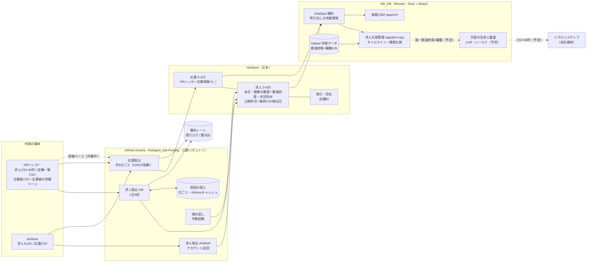

# 求人連携アーキテクチャ

更新日: 2026-10-09（件数はこの日の確認値）

HRハッカー・AirWork の求人と応募を HubSpot に集め、求人文面管理で「どの文面・どの媒体で応募が来たか」を比べ、自社媒体リクロジメディアへ転載するまでの全体像。

状態の表記: **稼働中** / **作業中** / **予定**。図の点線は作業中・予定の流れ。

## 全体の構成

## 処理ごとの説明

### 媒体からの求人の取り込み（稼働中）
- HRハッカーの求人CSV（84列）を1日3回取得。中身は日によって全ステータス分（約32,700件）か公開中のみ（約1,600件）
- 本文と画像を求人の2項目（求人票の本文 / 求人票の画像）に書く。値が変わったときだけ書くので、HubSpot の変更履歴がそのまま版の履歴になる
- 店舗一覧（4,081店舗）から、空の都道府県・市区町村を補う
- 既存求人の検索は0.5秒おき、429 は待って再試行。取込に失敗した回は前回の控えを進めない（同じ差分を次回に再試行）

### 応募の取り込み（稼働中。詳細ページは作業中）
- 約5分ごとに応募CSVを取り込み、応募を求人に関連付ける
- HRハッカーは応募者IDから詳細ページを開き、CSVに無い項目を追加する（別セッションが作業中。入れ先は「HRハッカー応募情報」の15項目）
- 詳細は新しく取り込んだ応募者だけ取りに行く（Actions の時間を抑える）

### ログと公開範囲（稼働中）
- Hubspot_Job-Posting は公開リポジトリ。Actions のログには件数と伏せ字だけを出す
- 会社名・取引IDなどの詳細と要対応リストは、非公開の集約シートへ
- 公開リポジトリなので Actions の時間は無料。非公開にする場合は、応募取込の移し先（Render など）が必要

### 求人文面管理（稼働中。HubSpot 履歴への切り替えは予定）
- タイムライン（掲載・給与・本文・画像・課金・応募・応募理由・市場）と横断比較
- 画像の変化は媒体CSVの画像URLで判定。変わった文字は比較画面で色付け
- いまは手で作った固定ファイル（36求人）を表示。HubSpot の履歴から版を組み立てる形に切り替える
- 都道府県×職種（Indeed の分類）で絞り込み、「この県のこの職種で応募が来た求人と理由」を引けるようにする

### リクロジメディアへの転載（予定）
- HRハッカーの求人票を基準に、同じ顧客で掲載中の AirWork 求人のどれとも重ならない文面を作る
- 給与・勤務地・勤務時間・雇用形態・休日は HRハッカーの値を写す（シールド）。審査はこちらのアプリで行う
- HRハッカーと同じ84列のCSV（UTF-8・BOM付き）で渡す。キーは HRハッカーの求人ID、店舗IDも渡す。画像はURL
- 閉じるのは2種類。求人単位は求人IDで、事業所の契約終了は店舗IDでまとめて
- 詳細は [`rikurozi-media-api-spec.md`](rikurozi-media-api-spec.md)

### HubSpot を正本にする理由
- 新しいDBを作らない方針（ADR-005 / ADR-006）。版の履歴は HubSpot の変更履歴、応募は応募オブジェクト
- 呼び出しの上限はアプリとバッチで分け合う（アプリは関所で流量を管理）
- 変更履歴は1項目あたり20件までの可能性があり、長期で使うときは要確認

## 同じ求人とみなす根拠

| 対象 | キー | 確認した事実 | 扱い |
|---|---|---|---|
| HRハッカーの求人 | `id_hrhakkaa` | 32,517件すべて別々の値 | 版・応募・転載のキー |
| AirWork の求人 | `airwork_account_login_id` + `id_airwork` | 求人IDだけでは108個が重複。アカウントと組み合わせれば重複なし | 版・応募のキー |
| HRハッカーと AirWork の関係 | 結び付けない | 両方のIDを持つ求人は0件。文面はわざと変えて出している | 別々の求人として並べて比べる |
| 事業所 | `店舗id` | 店舗一覧で全求人の店舗IDが見つかる | 勤務地・事業所単位のクローズ |
| まとめる単位 | 都道府県 × 職種 | 職種は Indeed の126分類に当てはめ、合わないものは「不明」 | 検索と逆算の分析 |

## 動く時刻と回数

| 処理 | 頻度 | 所要 | 書き先 |
|---|---|---|---|
| 応募取込 | 約5分ごと | 1回約3分 | HubSpot 応募 / 集約シート |
| HRハッカー求人取込 | 1日3回（1時・12時・20時。実際は遅れることあり） | 約5〜20分 | HubSpot 求人 |
| AirWork 求人取込 | 1日3回の巡回＋応募起点 | 数分〜十数分 | HubSpot 求人 |
| 本文・画像・勤務地の埋め戻し | 手動（2026-10-09 に実行済み） | 約20分 | HubSpot 求人 32,217件 |

時刻は日本時間。GitHub の定期実行は予定より遅れて始まることがある。

## まだ決まっていないこと
- リクロジメディアのCSVの受け取り方・列の形式・閉じる指示の渡し方（先方に確認中）
- 文面が「似すぎ」と判断する基準と、LLM の使い方
- 事業所の契約終了を HubSpot の取引から確実に判定できるか
- AirWork の「掲載中」をどう判定するか
