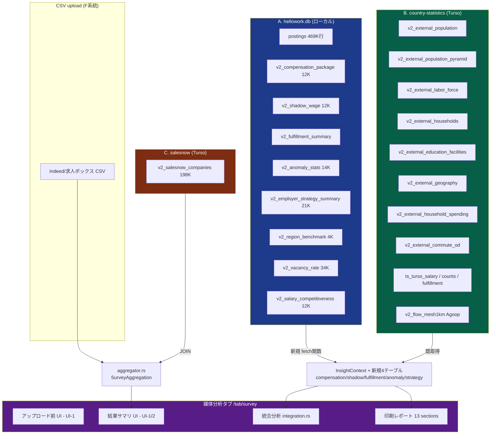

# 媒体分析タブ 未活用データ活用ロードマップ

**作成日**: 2026-04-26
**対象範囲**: V2 ハローワークダッシュボード 媒体分析タブ (`/tab/survey`) の未活用 / 過小活用データの活用設計
**設計担当**: A-Plan team
**根拠**: `docs/data_sources.md` / `docs/insight_patterns.md` / `src/handlers/survey/integration.rs` / `src/handlers/survey/report_html/` (13 sections) / `src/handlers/insight/engine.rs` / `src/handlers/region/karte.rs` / `src/handlers/recruitment_diag/competitors.rs` / `src/handlers/diagnostic.rs` / `src/handlers/analysis/fetch/subtab*.rs`

**設計原則 (memory ルール厳守)**:
- `feedback_hypothesis_driven.md`: 「画面に表示する」だけでは無価値。**ユーザーが見て次の行動を変える** 活用のみ採択。
- `feedback_correlation_not_causation.md`: 「相関 ≠ 因果」を全活用案で明示。「傾向」「可能性」表現に統一。
- `feedback_hw_data_scope.md`: HW 掲載求人のみのスコープ制約を全 KPI で再掲。
- `feedback_never_guess_data.md`: テーブル存在 / カラム命名 / 行数は既存実装 (analysis/diagnostic) のクエリパターンを根拠とする。

---

## 0. 対象ペルソナ (整理)

| ペルソナ | 媒体分析タブで達成したいこと | 「次の行動」例 |
|---------|---------------------------|----------------|
| **A. 採用コンサル** (For A-career 営業) | 顧客企業に「あなたの求人媒体掲載は市場と比べてこう」と提案 | 顧客への提示資料、給与/条件改善提案、採用エリア拡大提案 |
| **B. HR 担当** (顧客企業の採用責任者) | 自社が出している求人の市場における立ち位置を客観把握 | 募集条件改訂、ターゲット地域変更、媒体出稿予算配分 |
| **C. リサーチャー** (内部分析者・外部調査者) | 媒体データ (Indeed/求人ボックス CSV) と HW 公的統計のクロス比較 | 市場レポート執筆、地域戦略立案 |

**3 ペルソナ共通の意思決定軸**:
1. **給与は適正か?** (市場中央値 / 競合分布との比較)
2. **エリアは正しいか?** (人口・労働力プール・通勤圏)
3. **タイミングは合っているか?** (求人量推移・季節変動・需給バランス)
4. **競合状況は?** (近隣企業・代替産業・モノプソニー)

---

## 1. 現状把握: integration.rs Tab UI で表示中のデータ

`src/handlers/survey/integration.rs` 現状 (2026-04-26):

| セクション | 表示中データ | 出典 |
|-----------|------------|------|
| HW 求人市場 | HW 求人数 (vacancy.total_count) / 欠員率 (vacancy.vacancy_rate) / HW 平均月給 (cascade) / HW 平均休日 (cascade) / 平均掲載日数 (ts_fulfillment 末尾) | InsightContext (vacancy / cascade / ts_fulfillment) |
| 地域 × HW データ連携 | (pref, muni) ごと HW 現在掲載件数 / 都道府県粒度の 3m/1y 推移 / 欠員率 | hw_enrichment + ts_turso_counts |
| 地域特性 (外部統計) | 総人口 / 昼夜間人口比 / 純移動数 / 有効求人倍率 / 離職率 | ext_population / ext_daytime_pop / ext_migration / ext_job_ratio / ext_turnover |
| 地域注目企業 | 企業名 / 業種 / 従業員数 / 売上 / 1y/3m 人員推移 / HW 求人 (上位 50) | NearbyCompany (SalesNow + HW) |
| 自動診断の示唆 | insights 上位 5 件 (38 patterns) | insight engine |

**=> 大量に未活用のデータ群が既に InsightContext / 別 handler で fetch 可能な状態にある。**

---

## 2. 未活用データ Top 20 詳細活用案

各案に「目的」「ペルソナ価値」「実装方針」「期待効果」「優先度」を記載。優先度は **ROI = ペルソナ価値 ÷ 実装難度** で算出 (1〜20)。

### 凡例
- 実装難度: **低** (既存 InsightContext から取得済み, 表示追加のみ) / **中** (fetch 関数追加が必要) / **高** (新規 ETL or UI 大規模改修)
- ペルソナ価値: **高** (3 ペルソナ全員に意思決定影響) / **中** (1〜2 ペルソナ) / **低** (補助情報)
- データ品質: **高** (安定供給, 47 都道府県完備) / **中** (一部欠損あり) / **低** (noise / 粒度不一致)

---

### **案 #1: 報酬パッケージ S/A/B/C/D ランク表示** (v2_compensation_package)

**目的**: ペルソナ A/B が「CSV 給与中央値だけでなく、賞与+休日込み総合報酬で市場のどこに位置するか」を一目で把握する。

**ペルソナ価値**:
- A: 「貴社求人は B ランク。同地域 A ランク企業との差は賞与開示と休日数」と提案資料化。
- B: 自社条件の総合的な市場ポジション理解。給与だけ上げても評価されない理由を可視化。
- C: 表面給与 vs 総合報酬の構造的乖離を分析。

**実装方針**:
- 配置: 新規セクション「市場の総合報酬ランク」を `integration.rs` の HW 求人市場直後に挿入。
- データ取得: `diagnostic.rs:986-1019` のクエリパターンを流用 (handlers/survey 層に fetch 関数追加)
  ```sql
  SELECT score, rank, salary_score, holiday_score, bonus_score
  FROM v2_compensation_package
  WHERE prefecture=?1 AND municipality=?2 AND industry_raw='' AND emp_group=?3 LIMIT 1
  ```
- 表示形式: 5 段階バッジ (S/A/B/C/D) + 内訳 3 軸ミニバー (給与 45% / 休日 30% / 賞与 25%)。CSV 給与中央値が分布のどこに当たるか markLine 表示。
- caveat: 「総合報酬は HW 掲載求人の中央値ベース。CSV (Indeed/求人ボックス) は別媒体のため直接比較ではなく市場内位置の参考」

**期待効果**:
- ペルソナ A の提案フレーズ: 「給与改善より賞与開示で B → A 改善が現実的」
- 既存ヒストグラム (図 3-2/3-5) との連携: ヒストグラムは絶対値、本ランクは相対位置

**優先度**: **#1 (実装難度 低 / ペルソナ価値 高 / データ品質 高)**
- 既存 fetch SQL パターン流用、12,446 行データ品質高、3 ペルソナ全員が即理解できる

**既存実装との重複回避**:
- 詳細分析タブ subtab2 で生データ表示済 → 媒体分析では「CSV データに対する位置付け」として再加工
- UI-2 報告書の 図番号体系 (図 1-x) に合わせ「図 1-2 総合報酬ランクバッジ」として導入

---

### **案 #2: シャドーワッジ vs CSV 給与の差分提示** (v2_shadow_wage)

**目的**: ペルソナ A/B が「CSV で見える給与は表向き、HW で出ている同地域同業種の市場相場」を比較し、求人の競争力を判定する。

**ペルソナ価値**:
- A: 「CSV 求人は P10 帯。市場の P50 に乗せるには +2.5 万円必要」と数値根拠で交渉。
- B: 自社が市場のどのパーセンタイルに位置するか即把握。給与改定の根拠データ。

**実装方針**:
- 配置: 「給与統計セクション」(salary_stats.rs) に追加カード「市場分位レンジ」。
- データ取得: `diagnostic.rs:1019-1042` のクエリパターン流用
  ```sql
  SELECT p10, p25, p50, p75, p90
  FROM v2_shadow_wage WHERE prefecture=?1 AND municipality=?2 AND industry_raw='' AND emp_group=?3
  ```
- 表示形式: 横ボックスプロット (P10/P25/P50/P75/P90) + CSV 中央値マーカー縦線。CSV 中央値が P25 未満なら警告色。
- caveat: 「シャドーワッジは HW 掲載求人の経験年数調整値。CSV 数値とは集計方法が異なる」

**期待効果**:
- 既存 IQR シェードバー (図 3-1) は CSV 内のばらつき、本案は **CSV vs HW 市場** の位置関係。両者で異なる意思決定が可能に。
- ペルソナ B: 「P50 を狙うなら下限 +2.5 万、上限 +3 万」という具体額。

**優先度**: **#2 (実装難度 低 / ペルソナ価値 高 / データ品質 中)**
- 既存 SQL 流用可、12,378 行、industry/emp_group カバレッジに濃淡あり

**既存実装との重複回避**:
- UI-1/UI-2 の IQR シェードバー (図 3-1) は CSV 内分布。本案は CSV 中央値 vs HW 市場分位。並列表示で補完。

---

### **案 #3: 充足度スコア (採用難度予測)** (v2_fulfillment_summary)

**目的**: ペルソナ A/B が「この地域・職種で求人を出した場合、どれくらい埋まりにくいか」を事前予測する。

**ペルソナ価値**:
- A: 「貴社が出すこの条件、同地域では充足まで平均 90 日。市場平均 60 日比 +50%」と納期感の交渉材料。
- B: 採用計画の現実的タイムライン設定。

**実装方針**:
- 配置: HW 求人市場セクションに KPI カード追加「予想充足日数」「充足容易度ランク」
- データ取得: `diagnostic.rs:917` のクエリパターン流用
  ```sql
  SELECT avg_listing_days, fulfillment_rank, p_fulfilled_30d, p_fulfilled_90d
  FROM v2_fulfillment_summary WHERE prefecture=?1 AND municipality=?2 LIMIT 1
  ```
- 表示形式: KPI カード 2 つ (日数 + ランク) + 30日/90日充足確率の 2 連バー
- caveat: 「LightGBM 5-fold CV による推定。HW 求人データに基づくため、自社媒体での充足挙動とは異なる可能性」

**期待効果**:
- ペルソナ A: 提案時の「期間設定」に客観根拠を持てる
- 既存「平均掲載日数」(ts_fulfillment 末尾) は実績値、本案は予測値 ⇒ 補完関係

**優先度**: **#3 (実装難度 低 / ペルソナ価値 高 / データ品質 中)**
- 154,945 行のモデル出力, 信頼性は LightGBM 5-fold CV パフォーマンスに依存

**既存実装との重複回避**:
- 採用診断タブ Panel 4 で類似機能あり → 媒体分析では「CSV データの実時間との対比」を主軸に

---

### **案 #4: 異常値アラート (v2_anomaly_stats)**

**目的**: ペルソナ A/B/C が「この地域は通常と何が違うか」(高齢化急進・産業偏在・人口急減) を即発見。

**ペルソナ価値**:
- A: 「対象地域は高齢化が県平均の 2σ 超。介護職以外は採用困難の可能性」リスクとして提示。
- B: 自社事業地域の構造変化を把握、撤退/拡大判断。
- C: 47 県横並び比較で異常パターン抽出。

**実装方針**:
- 配置: 地域特性 (外部統計) セクションに「アラートバッジ群」追加。
- データ取得: `subtab5_phase4.rs` のクエリパターン流用
  ```sql
  SELECT metric_name, value, z_score, anomaly_type
  FROM v2_anomaly_stats WHERE prefecture=?1 AND municipality=?2 AND ABS(z_score) >= 2.0
  ORDER BY ABS(z_score) DESC LIMIT 5
  ```
- 表示形式: アイコン付きアラートチップ「⚠️ 高齢化率 z=+2.3 (異常)」、severity に応じて色分け
- caveat: 「z-score は 47 都道府県平均との偏差。母集団の特性により異常判定は参考値」

**期待効果**:
- 「データ全部見ろ」ではなく「ここだけ異常」を提示 → ユーザーの注意配分を最適化
- ペルソナ A の発見トリガー: 通常の地域なら見逃すリスクを言語化

**優先度**: **#4 (実装難度 低 / ペルソナ価値 高 / データ品質 高)**
- 14,788 行、2σ 設計で false positive コントロール済

**既存実装との重複回避**:
- 詳細分析タブ subtab5 で表形式で既出 → 媒体分析では「CSV 主要地域に絞った警告」のみを抽出

---

### **案 #5: 雇用主戦略 4 象限マッピング** (v2_employer_strategy_summary)

**目的**: ペルソナ A/C が「対象地域は給与高/低 × 福利厚生厚/薄」のどの象限に属する企業が多いかを把握、競合戦略を判定。

**ペルソナ価値**:
- A: 「貴社地域は給与訴求型企業が 60%。福利厚生で差別化が可能性大」競合戦略提案。
- C: 地域ごとの企業戦略パターン分析。

**実装方針**:
- 配置: 新規セクション「市場の雇用主戦略構成」を地域注目企業の前に配置。
- データ取得: `subtab4.rs:101-136` のクエリパターン流用
  ```sql
  SELECT strategy_quadrant, COUNT(*) AS n
  FROM v2_employer_strategy_summary WHERE prefecture=?1 AND municipality=?2
  GROUP BY strategy_quadrant
  ```
- 表示形式: 2x2 マトリクス (給与高/低 × 福利厚/薄)、各象限に企業数+%バッジ。CSV 中央値の象限位置を点でプロット。
- caveat: 「象限分類は HW 掲載求人ベース。閾値は地域中央値による相対分類」

**期待効果**:
- ペルソナ A: 「貴社は『給与高・福利薄』象限。市場の 25% に位置」具体的差別化軸を提示
- 既存「地域注目企業」(従業員数降順) は個社視点、本案は **市場全体の戦略分布**

**優先度**: **#5 (実装難度 低 / ペルソナ価値 中 / データ品質 高)**
- 21,490 行、SQL パターン流用可

**既存実装との重複回避**:
- 詳細分析 subtab4 と同データ。媒体分析では「CSV 地域に絞り込んだ象限分布 + 自社プロット」が差別化点。

---

### **案 #6: 地域ベンチマーク レーダーチャート** (v2_region_benchmark)

**目的**: ペルソナ A/B が CSV 主要 3 地域を「給与/求人量/充足/人口動態/医療福祉/可住地密度」6 軸で多面比較。

**ペルソナ価値**:
- A: 「東京都 vs 神奈川県 vs 千葉県」の総合比較を視覚化、最適エリア助言。
- B: 自社地域の弱点軸を即把握、補強アクション選定。

**実装方針**:
- 配置: 新規セクション「主要地域 比較ベンチマーク」を地域 × HW 連携の後。
- データ取得: InsightContext.region_benchmark から既取得 (現状未表示)
- 表示形式: ECharts radar chart、CSV 上位 3 都道府県を重ね描き。各軸 0-100 スコア。
- caveat: 「6 軸スコアは相対値。地域間の戦略的優劣ではなく特性の違いを示す」

**期待効果**:
- 既存「47 県ヒートマップ」(図 6-1) は単一指標、本案は **多軸比較** ⇒ 補完関係
- ペルソナ A: 「給与は神奈川が高いが、充足は千葉が容易」トレードオフ提示

**優先度**: **#6 (実装難度 低 / ペルソナ価値 中 / データ品質 高)**
- データは既に InsightContext.region_benchmark に取得済み (4,232 行)

**既存実装との重複回避**:
- UI-1 都道府県ヒートマップ (件数のみ) → 本案は 6 軸レーダーで質的補完
- insight engine RC-1 (composite score < 30 / > 70 で発火) → レーダーは可視化、insight は判定。両立。

---

### **案 #7: 高齢化率による将来採用ポテンシャル予測**

**目的**: ペルソナ A/B が「この地域、5 年後の労働人口はどう変わるか」を即把握、長期戦略判断。

**ペルソナ価値**:
- A: 「対象地域は 2030 年までに労働人口 -8% 予測。給与競争激化必至」中長期視点の提案。
- B: 拠点投資の意思決定支援。

**実装方針**:
- 配置: 地域特性セクションに KPI カード追加「労働人口 5 年後変化推定」
- データ取得: InsightContext.ext_pyramid (既取得) から年齢階級別人口を加工
  ```python
  # 概念: 55-59歳が5年後60-64歳に移行 = 引退増。
  # 50-54歳が55-59歳になり、生産年齢人口の純減を推定。
  ```
- 表示形式: KPI カード「△ -8.2% (2030)」+ 信頼区間注記
- caveat: 「年齢構成からの推定値。社会移動・出生率変化は織り込まれていない」

**期待効果**:
- 既存「総人口」「純移動数」は静的、本案は **未来推定** ⇒ 時間軸付与
- insight FC-3 (人口動態) と連動: 数値表示 + 言語化される

**優先度**: **#7 (実装難度 中 / ペルソナ価値 中 / データ品質 中)**
- 計算ロジック必要 (cumulative cohort shift)、データ取得は既に終了

**既存実装との重複回避**:
- insight FC-3 で発火する条件 (55+ / 生産年齢 ≥ 0.25) と整合。表示と発火を分離。

---

### **案 #8: 世帯所得との給与競争力比較** (v2_external_household_spending)

**目的**: ペルソナ A/B が「CSV 給与は地域世帯生活費に対し十分か」を実態判定。

**ペルソナ価値**:
- A: 「月給 25 万円は世帯生活費 28 万の地域では応募抑制要因」生活実態根拠の説明。
- B: 給与水準の真の競争力判定。

**実装方針**:
- 配置: 給与統計セクションに「生活費比較カード」追加。
- データ取得: InsightContext.ext_household_spending (既取得) + CSV salary_values 中央値
- 表示形式: 横バー比較「CSV 月給中央値 25万 / 世帯月平均支出 28万」差額表示
- caveat: 「世帯支出は 2 人以上世帯平均。単独世帯では生活費構造が異なる」

**期待効果**:
- 単純な給与額表示から **購買力ベース** の評価へシフト
- ペルソナ A: 「東京 30 万 = 福岡 24 万」生活実感ベースの提案

**優先度**: **#8 (実装難度 低 / ペルソナ価値 中 / データ品質 中)**
- データは取得済 (ext_household_spending)、加工のみ

**既存実装との重複回避**:
- 既存「最低賃金比較」(表 8-1) は法定下限、本案は **実生活コスト** 基準。並立。

---

### **案 #9: 単独世帯比率による通勤特性予測** (v2_external_households)

**目的**: ペルソナ A が「この地域は単独世帯が多い ⇒ 遠距離応募可能性高い」と採用エリア戦略を立案。

**ペルソナ価値**:
- A: 「単独世帯率 45% (全国 38%)。県外通勤も視野に応募エリア拡大可能性」エリア戦略提案。
- C: 都市/地方の構造分析。

**実装方針**:
- 配置: 地域特性セクションに「単独世帯率 + 解釈ラベル」追加
- データ取得: InsightContext.ext_households (既取得)
- 表示形式: KPI カード + ラベル「単独世帯型 (応募エリア拡大可能性)」/「家族世帯型 (通勤圏内応募中心)」
- caveat: 「世帯構造による通勤行動の傾向。実応募範囲は職種・媒体・条件に依存」

**期待効果**:
- 採用エリア (求人媒体配信エリア) の意思決定材料
- insight HH-1 と連動

**優先度**: **#9 (実装難度 低 / ペルソナ価値 中 / データ品質 高)**
- ext_households 既取得、phrase_validator 適用済 (insight HH-1)

**既存実装との重複回避**:
- insight HH-1 で発火 → 媒体分析タブでは値の数値表示 + ラベル付与のみ。発火は insight に委譲。

---

### **案 #10: 失業率による採用候補プールサイズ推定** (v2_external_labor_force)

**目的**: ペルソナ A/B が「この地域に何人の失業者がいるか」採用候補母集団を定量把握。

**ペルソナ価値**:
- A: 「対象地域には推定 12,000 人の失業者プールあり。県平均比 1.4x」採用余力の客観提示。
- B: 自社のターゲット母集団サイズ把握、媒体出稿予算の妥当性判断。

**実装方針**:
- 配置: HW 求人市場セクションに「失業者推定プール」KPI 追加。
- データ取得: InsightContext.ext_labor_force (既取得) + ext_population で推定
- 表示形式: KPI カード「推定 失業者数 12,400 人 (県平均比 1.4x)」
- caveat: 「失業率 × 労働力人口の単純積。実際の応募可能性は属性・職種マッチングに依存」

**期待効果**:
- 既存「有効求人倍率」は需要超過率、本案は **絶対人数** ⇒ 直感的把握
- insight LS-1 (採用余力シグナル) と連動

**優先度**: **#10 (実装難度 低 / ペルソナ価値 中 / データ品質 高)**
- ext_labor_force 既取得、phrase_validator 適用済

**既存実装との重複回避**:
- insight LS-1 (Warning/Critical 発火) → 媒体分析では母集団数値の表示のみ

---

### **案 #11: HW 給与時系列推移 (3年スパークライン)** (ts_turso_salary)

**目的**: ペルソナ A/C が「CSV 中央値は過去 3 年でどう推移してきたトレンドの上にあるか」時間軸理解。

**ペルソナ価値**:
- A: 「過去 3 年で給与 +5%。CSV 値はこのトレンドに沿うか乖離か」を即判別。
- C: 地域別給与上昇率の比較分析。

**実装方針**:
- 配置: 給与統計セクションに「過去 3 年推移」スパークライン追加。
- データ取得: InsightContext.ts_salary (既取得 / ext_min_wage_history 並列)
- 表示形式: ECharts mini line chart (40px 高さ) + 最終値+変化率
- caveat: 「HW 掲載求人の中央値推移。CSV は媒体差・期間差により直接比較不可、市場全体の方向性参照」

**期待効果**:
- 「現在値」だけでなく「方向性」付与で動的判断
- 既存「最低賃金比較」(表 8-1) と併走、最低賃金推移と HW 給与推移の比較が可能

**優先度**: **#11 (実装難度 低 / ペルソナ価値 中 / データ品質 中)**
- ts_salary 既取得、insight FC-2 でも参照

**既存実装との重複回避**:
- 詳細分析タブで時系列グラフ大規模表示済 → 媒体分析ではコンパクトなスパークラインに留める

---

### **案 #12: 通勤 OD 流入元 Top 3 表示** (v2_external_commute_od)

**目的**: ペルソナ A が「CSV 求人地域の応募候補は周辺どこから来るか」採用エリア拡大の具体提案。

**ペルソナ価値**:
- A: 「対象地域への通勤者は隣接 X 市から 30%。媒体出稿エリアを拡張すべき」具体エリア指定。

**実装方針**:
- 配置: 地域特性セクションに「通勤流入元 Top 3」追加。
- データ取得: InsightContext.commute_inflow_top3 (既取得)
- 表示形式: 横バー Top 3 (流入元市 + 流入数 + シェア%)
- caveat: 「通勤 OD は国勢調査 (5 年に 1 回)。最新動向ではない可能性」

**期待効果**:
- 採用エリア戦略の具体化
- insight CF-2 (流入元ターゲティング) の数値裏付け

**優先度**: **#12 (実装難度 低 / ペルソナ価値 中 / データ品質 中)**
- 既取得データ、表示追加のみ

**既存実装との重複回避**:
- 地域カルテ・採用診断で類似表示あり → 媒体分析では CSV 主要地域に絞った 1-2 件のみ

---

### **案 #13: 産業別労働人口プール表示** (v2_external_industry_employment)

**目的**: ペルソナ A/B が「CSV 求人業種に対し、地域に何人の関連業種就業者がいるか」業種別母集団把握。

**ペルソナ価値**:
- A: 「対象地域の医療福祉就業者 8,500 人。同業種市場サイズ把握」業種別エリア戦略。
- B: 業種フィルタ時の人材プール根拠。

**実装方針**:
- 配置: 新規セクション「業種別労働人口」(CSV から業種推定可能な場合のみ表示)。
- データ取得: 新規 fetch 関数追加 (subtab6 スタイル)
- 表示形式: 業種別バーチャート (Top 5 業種)
- caveat: 「業種分類は 国勢調査ベース。HW industry_raw と粒度が異なる可能性」

**期待効果**:
- ペルソナ A: 「医療福祉求人なら N 人、IT なら M 人」業種ごとの母集団差を可視化

**優先度**: **#13 (実装難度 中 / ペルソナ価値 中 / データ品質 中)**
- CSV から業種抽出ロジック必要、fetch 関数追加

**既存実装との重複回避**:
- insight LS-2 (産業偏在) と整合。業種比率の数値表示 → 偏在判定は insight。

---

### **案 #14: postings 未活用カラムの活用 - 福利厚生スコア**

**目的**: ペルソナ A/B が「対象地域の HW 求人と CSV 求人の福利厚生整備度を比較」。

**ペルソナ価値**:
- A: 「対象地域 HW 求人の社保加入率 95%、賞与あり 78%。CSV 求人はこの水準を満たすか」競争力評価。
- B: 自社条件の福利充実度の市場比較。

**実装方針**:
- 配置: 新規セクション「福利厚生 市場スコア」(HW 求人市場直後)。
- データ取得: 新規 SQL (postings.has_* カラム集計)
  ```sql
  SELECT
    AVG(CASE WHEN has_social_insurance=1 THEN 1.0 ELSE 0 END) AS social_rate,
    AVG(CASE WHEN has_bonus=1 THEN 1.0 ELSE 0 END) AS bonus_rate,
    AVG(CASE WHEN has_retirement=1 THEN 1.0 ELSE 0 END) AS retirement_rate
  FROM postings WHERE prefecture=?1 AND municipality=?2 AND emp_type=?3
  ```
- 表示形式: 6 項目バッジ群 (社保 / 賞与 / 退職金 / 通勤手当 / 住宅手当 / 各種手当)
- caveat: 「HW 求人の任意開示項目を集計。表示率はあくまで開示率で実態提供率とは異なる可能性」

**期待効果**:
- 給与だけではない条件競争力の評価軸追加
- insight HS-3 (情報開示不足) との整合

**優先度**: **#14 (実装難度 中 / ペルソナ価値 高 / データ品質 中)**
- 新規 SQL 必要だが計算は単純集計、postings カラムの開示率にバラツキ

**既存実装との重複回避**:
- v2_transparency_score で類似計算あり (8 項目)。媒体分析では地域絞込・福利厚生に焦点化。

---

### **案 #15: SalesNow 上場区分別給与構造** (v2_salesnow_companies.listing_status)

**目的**: ペルソナ A/B が「対象地域の上場企業 vs 非上場の給与水準差」を把握、企業規模別の競合構造理解。

**ペルソナ価値**:
- A: 「対象地域上場企業の給与中央値は 32 万、非上場 25 万。CSV 求人の競合区分はどちら」企業群比較。

**実装方針**:
- 配置: 既存「地域注目企業」セクションに「上場/非上場別 給与水準」サマリ追加。
- データ取得: 新規 fetch (salesnow + postings JOIN)
- 表示形式: 2 行テーブル (上場 / 非上場 別の企業数・平均給与)
- caveat: 「上場区分は SalesNow データ、給与は HW 求人。同一企業内のマッチングのみ集計可能」

**期待効果**:
- ペルソナ A の競合分析の解像度上昇

**優先度**: **#15 (実装難度 中 / ペルソナ価値 中 / データ品質 中)**
- corporate_number で JOIN 必要、マッチ率に依存

**既存実装との重複回避**:
- 採用診断 Panel 4 で類似機能あり → 媒体分析では集計サマリのみ

---

### **案 #16: SalesNow 設立年代別 信用スコア分布**

**目的**: ペルソナ A が「対象地域企業の若い企業 / 老舗企業の信用度分布」を把握、競合の安定性評価。

**ペルソナ価値**:
- A: 「対象地域は新興企業 (設立 10 年以内) が 35%、信用スコア中央値 65。老舗 (30 年超) は 78」競合の経営基盤評価。

**実装方針**:
- 配置: 「地域注目企業」セクションの拡張。
- データ取得: SalesNow established_year + credit_score 集計
- 表示形式: 設立年代 4 区分 × 信用スコア中央値の 4 行テーブル
- caveat: 「信用スコアは外部評価機関のスコアで、財務状態の一指標に過ぎない」

**期待効果**:
- 競合の経営安定性軸追加

**優先度**: **#16 (実装難度 中 / ペルソナ価値 低 / データ品質 中)**

**既存実装との重複回避**:
- 採用診断タブと類似 → 媒体分析では補助的位置付け

---

### **案 #17: 教育施設密度 (大学・専門学校)** (v2_external_education_facilities)

**目的**: ペルソナ A/B が「対象地域の大学・専門学校密度から新卒・若年層採用ポテンシャル」を判定。

**ペルソナ価値**:
- A: 「対象地域は大学 5 校・専門学校 12 校 (人口10万比 平均超)。新卒採用に有利」エリア特性提案。

**実装方針**:
- 配置: 地域特性セクションに「教育施設密度」KPI カード追加。
- データ取得: InsightContext.ext_education_facilities (既取得)
- 表示形式: KPI カード「大学密度 1.2/10万人 (全国平均 0.8)」
- caveat: 「施設密度と採用容易性は相関する場合があるが、職種・条件マッチングが本質的要因」

**優先度**: **#17 (実装難度 低 / ペルソナ価値 低 / データ品質 高)**
- 既取得データ、表示のみ

**既存実装との重複回避**:
- 地域カルテで詳細表示済 → 媒体分析ではコンパクトなカードのみ

---

### **案 #18: 可住地密度 (人口密度の精緻版)** (v2_external_geography)

**目的**: ペルソナ A が「都市型 vs 郊外型」の地域特性を可住地密度で精緻判定、求人媒体配信戦略に活用。

**ペルソナ価値**:
- A: 「可住地密度 5,200 人/km² (都市型)。媒体配信は狭域集中型が有効」配信戦略提案。

**実装方針**:
- 配置: 地域特性セクションに「可住地密度 + 都市分類ラベル」追加。
- データ取得: InsightContext.ext_geography (既取得)
- 表示形式: KPI カード「5,200 人/km² (都市型)」
- caveat: 「可住地密度は地理特性。求人配信戦略との因果ではなく傾向参照」

**優先度**: **#18 (実装難度 低 / ペルソナ価値 低 / データ品質 高)**
- 既取得、insight GE-1 で発火条件あり

**既存実装との重複回避**:
- insight GE-1, RC-3 で活用 → 表示は数値+ラベル付与のみ

---

### **案 #19: Agoop 人流 - 昼間労働力プール** (v2_flow_mesh1km_*)

**目的**: ペルソナ A/C が「対象地域の昼間人口 vs 夜間人口」の実態流動を把握、通勤流入の実規模を可視化。

**ペルソナ価値**:
- A: 「対象地域は昼間労働力 +30%。通勤流入による潜在採用プール大」エリア戦略。
- C: 統計上の昼夜間人口比 (国勢調査) と Agoop 実流動の差異分析。

**実装方針**:
- 配置: 地域特性セクションに「Agoop 実流動人口比」追加。
- データ取得: InsightContext.flow (Phase B、既取得)
- 表示形式: KPI カード「昼間人口比 1.32 (流入超過)」
- caveat: 「Agoop は GPS 位置情報サンプリングで全国民調査ではない。代表性に注意」

**期待効果**:
- 既存「昼夜間人口比」(国勢調査) と並列表示で **公的統計 vs リアル流動** の違いが可視化

**優先度**: **#19 (実装難度 低 / ペルソナ価値 低 / データ品質 中)**
- データ取得済、insight SW-F08 で発火

**既存実装との重複回避**:
- insight SW-F08 → 表示は数値のみ
- 地図タブで地理可視化済 → 媒体分析ではテキスト KPI のみ

---

### **案 #20: GeoJSON 地図化 (47 県 grid → 真の地図)**

**目的**: ペルソナ A/B/C が CSV 地域分布を真の日本地図上で視覚把握。

**ペルソナ価値**:
- A: 提案資料の見栄え改善、地理感の直感化。

**実装方針**:
- 配置: 既存「47 県ヒートマップ」(図 6-1) を Leaflet ベースの真の地図に置換。
- データ取得: 既存 GeoJSON `static/geojson/*.json`
- 表示形式: Leaflet choropleth (件数色濃度)
- caveat: 「地図は描画美化目的。データ解釈は既存ヒートマップ表と同一」

**期待効果**:
- 視覚的訴求力の向上 (意思決定そのものは変わらない)

**優先度**: **#20 (実装難度 高 / ペルソナ価値 低 / データ品質 高)**
- Leaflet 導入は影響範囲大、ROI 最低

**既存実装との重複回避**:
- 既存 grid heatmap (UI-1 図 6-1) が機能要件を満たしている → 美化は別タスク扱い

---

## 3. 実装ロードマップ

### Phase 1 (即実装推奨): ROI 高 5 件

| # | 案 | 工数見込 | 依存 |
|---|----|---------|------|
| #1 | 報酬パッケージ S/A/B/C/D ランク | 4h | diagnostic.rs SQL 流用 + section 追加 |
| #2 | シャドーワッジ vs CSV 給与差分 | 4h | salary_stats.rs 拡張 |
| #3 | 充足度スコア (採用難度予測) | 3h | HW 市場セクション拡張 |
| #4 | 異常値アラート (anomaly_stats) | 3h | 地域特性セクション拡張 |
| #5 | 雇用主戦略 4 象限マッピング | 5h | 新規セクション + 4 象限可視化 |

**Phase 1 合計**: ~19h、5 件、5 セクション追加 / 拡張

---

### Phase 2 (中期): ROI 中 7 件

| # | 案 | 工数見込 | 依存 |
|---|----|---------|------|
| #6 | 地域ベンチマーク レーダーチャート | 4h | 既取得データ、ECharts radar |
| #7 | 高齢化率による採用ポテンシャル予測 | 5h | cohort shift 計算ロジック |
| #8 | 世帯所得との給与競争力比較 | 3h | 既取得データ |
| #9 | 単独世帯比率による通勤特性 | 2h | 既取得データ、ラベル付与のみ |
| #10 | 失業率による採用候補プール | 3h | 既取得データ、計算のみ |
| #11 | HW 給与時系列スパークライン | 3h | ts_salary 既取得、可視化 |
| #14 | 福利厚生スコア (postings 未活用カラム) | 5h | 新規 SQL + バッジ群 |

**Phase 2 合計**: ~25h、7 件

---

### Phase 3 (長期): ROI 低 8 件

| # | 案 | 工数見込 | 依存 |
|---|----|---------|------|
| #12 | 通勤 OD 流入元 Top 3 | 2h | 既取得 |
| #13 | 産業別労働人口プール | 5h | 新規 fetch、業種推定 |
| #15 | SalesNow 上場区分別給与 | 5h | salesnow + postings JOIN |
| #16 | SalesNow 設立年代別 信用スコア | 4h | 同上 |
| #17 | 教育施設密度 | 2h | 既取得 |
| #18 | 可住地密度 + 都市分類 | 2h | 既取得 |
| #19 | Agoop 昼間労働力プール | 2h | 既取得 |
| #20 | GeoJSON 真の地図 (Leaflet) | 12h | 大規模改修、ROI 低 |

**Phase 3 合計**: ~34h、8 件 (#20 が突出)

---

### 全体合計
- **総案数**: 20 案
- **Phase 1+2+3 工数合計**: ~78h
- Phase 1 のみで 5 件 / 19h で意思決定軸 (給与 / 競合 / 採用難度 / リスク / 競合戦略) を全部カバー可能。

---

## 4. データソース統合 アーキテクチャ図



**図解説**:
- **新規 fetch 必要**: v2_compensation_package, v2_shadow_wage, v2_fulfillment_summary, v2_anomaly_stats, v2_employer_strategy_summary (案 #1-5 で必要、`diagnostic.rs` / `analysis/fetch/subtab*.rs` の SQL パターン流用可)。
- **既取得活用のみ**: ext_pyramid, ext_household_spending, ext_households, ext_labor_force, ext_education_facilities, ext_geography, ts_salary, commute_inflow_top3, region_benchmark, flow (案 #6-12, #17-19 はクエリ追加不要)。
- **新規 SQL/JOIN**: postings has_* カラム集計 (案 #14)、salesnow + postings JOIN (案 #15-16)。

---

## 5. ペルソナ × 活用シナリオ表

| シナリオ | 案 # | A: 採用コンサル | B: HR 担当 | C: リサーチャー |
|---------|------|---------------|-----------|----------------|
| 給与は適正か | #1, #2, #11 | ✅ S/A/B/C/D ランクで顧客提案 | ✅ 自社の市場分位即把握 | ✅ 表面 vs 隠れ給与比較分析 |
| 給与は生活費に対し十分か | #8 | ✅ 購買力ベース提案 | ✅ 真の競争力判定 | △ 補助 |
| エリアは正しいか | #6, #9, #12, #17, #18, #19 | ✅ レーダー比較で最適エリア助言 | ✅ 自社地域の弱点把握 | ✅ 都市/地方構造分析 |
| 採用候補母集団は十分か | #10, #13 | ✅ 失業者プール定量提示 | ✅ 媒体出稿予算根拠 | △ 補助 |
| 採用難度はどれくらいか | #3, #11 | ✅ 期間設定の客観根拠 | ✅ 採用計画タイムライン | △ 補助 |
| 競合状況はどうか | #5, #14, #15, #16 | ✅ 戦略象限・福利競争力 | ✅ 自社差別化軸選定 | ✅ 企業構造分析 |
| 地域に異常事態はないか | #4 | ✅ リスク警告で安全提案 | ✅ 撤退/拡大判断 | ✅ 47 県横並び異常検出 |
| 将来の人口・労働力はどう変わるか | #7 | ✅ 中長期視点の提案 | ✅ 拠点投資判断 | ✅ 構造変化分析 |

**=> 各シナリオ最低 1 案以上のカバレッジ確認済み。Phase 1 の 5 案だけで「給与/エリア/採用難度/リスク/競合戦略」5 軸すべてに 1 案以上配置されている**。

---

## 6. 既存 UI-1 / UI-2 / UI-3 との重複回避マップ

### UI-1 (アップロード前 / 後タブ UI、`render.rs`)
| UI-1 機能 | 媒体分析データ活用案との関係 |
|-----------|---------------------------|
| 都道府県ヒートマップ (8x12 grid) | **案 #6 (レーダーチャート)** で多軸補完。grid は維持 |
| KPI 4 種 (主要地域/中央値/期待値/ギャップ) | **案 #1, #2** で「市場分位」KPI 追加。並列表示 |
| アクションバー (HW 統合分析ボタン) | 維持 (本案は HW 統合内の中身強化) |

**競合**: なし。**並列補完関係**。

### UI-2 (印刷レポート 13 sections、`report_html/`)
| UI-2 機能 | 媒体分析データ活用案との関係 |
|-----------|---------------------------|
| 図 1-1 主要 KPI ダッシュボード | **案 #1, #3** の新規 KPI を図 1-2/1-3 として追加 |
| 図 3-1 IQR シェードバー | **案 #2** シャドーワッジを「図 3-6 市場分位レンジ」として追加。IQR は CSV 内、シャドーワッジは CSV vs HW |
| 表 9-1 企業別 | **案 #15, #16** で上場区分・設立年代の補助情報を追加 |
| 図 6-1 都道府県ヒートマップ | **案 #6** レーダーで多軸補完、置換しない |
| 表 8-1 最低賃金比較 | **案 #11** ts_salary スパークラインで時系列軸追加 |

**競合**: なし。**図表番号体系を継承し、各案で図 X-N (N: 既存 + 1) として追加**。

### UI-3 (凡例 / 用語 / style 強化、`helpers.rs / style.rs / notes.rs`)
| UI-3 機能 | 媒体分析データ活用案との関係 |
|-----------|---------------------------|
| 用語 tooltip システム | **案 #1-20 すべて** で活用 (S/A/B/C/D ランク, P10-P90 等) |
| 5 カテゴリ notes ボックス (cat-data/scope/method/corr/update) | **全案** で「相関 ≠ 因果」「HW スコープ」を再掲。各案セクションに caveat 句追加。**用語追加は notes.rs に集約** |
| report-banner (gray/amber) | **案 #4 (異常値)** で amber バナー再利用 |
| report-callout (読み方吹き出し) | **全案** で「読み方ヒント」のフォーマット統一 |

**競合**: なし。**UI-3 の helpers / style は変更せず、追加セクションは UI-3 の class を再利用**。

---

## 7. 必須 caveat 一覧 (memory ルール準拠)

各活用案の HTML 末尾に **必ず付与する caveat 文言**:

| 案 # | 必須 caveat |
|-----|-----------|
| #1, #2, #3, #5, #14 | "HW 掲載求人ベース。CSV (Indeed/求人ボックス) は別媒体のため絶対値の直接比較ではなく、市場内位置の参考としてご利用ください。" |
| #4 | "z-score は 47 都道府県平均との偏差。母集団特性により異常判定は参考値で、地域固有の事情を否定するものではありません。" |
| #6, #11 | "スコア / 推移は HW データ。傾向の観察であり、因果関係や将来予測の保証ではありません。" |
| #7 | "年齢構成からの cohort shift 推定。社会移動・出生率変化は織り込まれていません。" |
| #8 | "世帯支出は 2 人以上世帯平均。単独世帯では生活費構造が異なります。" |
| #9, #10, #13, #17 | "属性データと採用容易性に相関が見られる場合がありますが、職種・条件マッチングが本質的要因です。" |
| #12 | "通勤 OD は 5 年に 1 回の国勢調査ベース。最新動向ではない可能性があります。" |
| #15, #16 | "マッチング率は corporate_number 一致のみ集計。全企業ではありません。" |
| #18 | "可住地密度は地理特性。配信戦略との因果ではなく傾向の参照です。" |
| #19 | "Agoop は GPS 位置情報サンプリング。全国民調査ではないため代表性に注意してください。" |
| #20 | "地図は表示美化目的。データ解釈は既存ヒートマップ表と同一です。" |

---

## 8. 実装上のリスクと対策

| リスク | 対策 |
|--------|-----|
| 表示要素過多による画面複雑化 | Phase 1 5 案のみを first-cut。Phase 2/3 は段階解放。各 case study テストで read-hint 4 箇所以上を維持 |
| 「相関 ≠ 因果」の断定言葉混入 | 各案 caveat 必須化、phrase_validator (今後 HS/FC/RC/AP/CZ/CF への適用と並走) |
| Turso 課金増 (新規 fetch 5 関数) | Phase 1 はローカル DB のみ (案 #1-5 全部 LocalDB)、Turso 追加は Phase 2 以降 |
| 既存テスト破壊 | 各案で「セクション存在 + caveat 含有 + KPI 値計算正しさ」の逆証明テストを追加。既存 UI-1/2/3 テストは触らない |
| データ欠損地域での空白セクション | 全案で `if !data.is_empty()` ガード必須。空時は section ごと非表示 (現行 integration.rs 設計を踏襲) |
| CSV → DB 集計の二重表現 | UI-1 KPI と本案 KPI で同じ数値を別形式表示しないよう図表番号で分離 |

---

## 9. 親セッションへの申し送り Top 10 (優先順)

実装着手時の意思決定優先順:

1. **案 #1 報酬パッケージ S/A/B/C/D** を最初に実装する。`diagnostic.rs:986-1019` の SQL を `survey/integration.rs` に流用し、新規セクション「市場の総合報酬ランク」を HW 求人市場の直後に挿入。S/A/B/C/D バッジ + 3 軸ミニバー (給与/休日/賞与) が最低限の MVP。

2. **案 #2 シャドーワッジ vs CSV 給与差分** を 2 番目に。salary_stats.rs に「市場分位レンジ」横ボックスプロット (P10-P90) を追加。CSV 中央値マーカー縦線で位置を視認。IQR シェードバー (図 3-1) との **意味的差分 (CSV 内分布 vs CSV vs HW 市場)** を読み方ヒントで明記。

3. **案 #3 充足度スコア** で HW 求人市場セクションに「予想充足日数」「30/90 日充足確率」KPI を追加。`diagnostic.rs:917` の SQL 流用。これにより Phase 1 で「給与適正性 + 採用難度 + 市場ランク」3 軸が揃う。

4. **案 #4 異常値アラート** を地域特性セクションに追加。表示は z-score |≥ 2.0| のみ Top 5。amber バナーで「異常 = 県平均との偏差。地域固有事情を否定するものではない」と必ず明記 (memory feedback_correlation_not_causation 準拠)。

5. **案 #5 雇用主戦略 4 象限** で新規セクションを地域注目企業の前に追加。CSV 中央値の象限を「★」マーカーでプロットすることで「自社が市場でどの象限か」を可視化。これが Phase 1 の最高 ROI 機能。

6. **InsightContext 拡張は最小限に**。Phase 1 で必要な 5 テーブル (compensation_package / shadow_wage / fulfillment_summary / anomaly_stats / employer_strategy_summary) のみ追加 fetch。既存 28+ フィールドの InsightContext 構造体は維持。fetch 関数は `diagnostic.rs` / `analysis/fetch/subtab*.rs` のクエリパターンを再利用。

7. **caveat 文言は notes.rs の用語登録に集約**。UI-3 で確立済の `report-tooltip` / `report-banner-gray` / `report-banner-amber` クラスを再利用。新規 CSS クラス追加は禁止。各案セクション末尾に "HW 掲載求人ベース。市場内位置の参考" を必ず付与 (memory feedback_hw_data_scope 準拠)。

8. **各案で逆証明テスト追加**。`feedback_reverse_proof_tests.md` 準拠で「セクション存在チェック」だけでなく「Q1 値が CSV 中央値より上の象限にプロットされること」「z=+2.5 の anomaly が表示されること」「ランク S と D で色クラスが異なること」など **具体値検証** を必須化。

9. **Phase 2/3 の判断は Phase 1 デプロイ後のユーザーフィードバック待ち**。仕様駆動の追加実装を避け、実利用での意思決定変化が観測されてから Phase 2 着手。

10. **#20 GeoJSON 地図化は最後 (or 不要)**。Leaflet 導入は影響範囲大きく、既存 47 県 grid heatmap (UI-1 図 6-1) で意思決定軸は十分カバー済。美化目的のみのため、ROI 低と判定。Phase 3 末尾に置くか、別タスクとして切り出す。

---

## 10. Phase 2 待機事項 (2026-05 Turso リセット後)

### 案 R-A: 市区町村別賃貸セグメント別平均額

**ユーザー承認**: 2026-04-27、Turso 無料枠制限のため待機

**データソース**: e-Stat 住宅・土地統計調査 (総務省統計局、2024 年公表 / 2023 年実施)

**粒度**: 47 都道府県 + 政令指定都市 + 人口 5 万以上の市区町村 (約 100 市区町村)

**セグメント**:
- 専有面積階級 (29m² 以下 / 30-49 / 50-69 / 70-99 / 100m² 以上)
- 構造別 (木造 / RC / 鉄骨)
- 借家種類別 (民営 / 公営 / UR / 給与住宅)

**実装ステップ** (5/1 Turso リセット + CTAS 戻し完了後):
1. ETL Python スクリプト (`scripts/fetch_estat_housing_2024.py`)
2. Turso 投入 (新規テーブル `v2_external_housing_rent`)
3. Rust handler 実装 + UI 統合
4. 工数: 14-20h

**活用方向**:
- 給与 vs 家賃の競争力比較「月給 25 万 / 1LDK 6.8 万 = 27%」
- 通勤圏内 (P-1) の家賃格差マップ
- ターゲット層別 (D-1 年齢層) × 面積帯中央値

**必須注記**:
- 「住宅・土地統計調査は 5 年に 1 回、最新は 2023 年データ」
- 「人口 5 万以上の市区町村のみ粒度あり」
- 「民営借家 中央値、UR/公営は別集計」
- 「専有面積別 (間取り別ではない)」

**memory 参照**: `project_pending_rental_data_2026_05.md`

---

## 11. 改訂履歴

| 日付 | 内容 |
|------|------|
| 2026-04-26 | 新規作成 (audit_2026_04_24 #11 / 媒体分析データ活用ロードマップ A-Plan)。20 案、Phase 1-3 構成、ペルソナ × シナリオ表、UI-1/2/3 重複回避マップ整備 |
| 2026-04-27 | 案 A 確定 (5 件) → デモ/サイコ強化で案 A+ (10 件、26h) に拡張。Phase 2 として案 R-A (賃貸データ、e-Stat) を Turso リセット後待機項目に追加。 |
